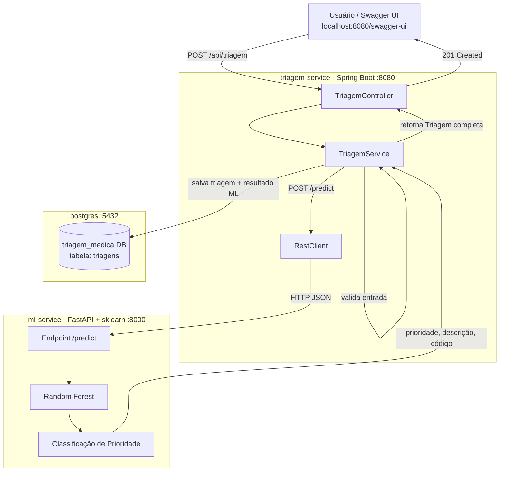

# Triagem Médica Inteligente

Sistema de triagem médica que utiliza Machine Learning para classificar a prioridade de atendimento de pacientes com base no Protocolo de Manchester, analisando sinais vitais em tempo real.

Matéria: Microserviços para Ciência de Dados
Grupo 2 - Faculdade DonaDuzzi

## Arquitetura



Fluxo:

1. Usuário envia sinais vitais via Swagger ou curl
2. Java valida os dados e repassa ao serviço Python
3. Python classifica com Random Forest seguindo o Protocolo de Manchester
4. Java salva o resultado no PostgreSQL e retorna a prioridade ao usuário

## Tecnologias

| Camada | Tecnologia |
|---|---|
| API Backend | Java 21 + Spring Boot 4 |
| Modelo ML | Python 3.11 + FastAPI + scikit-learn |
| Banco de dados | PostgreSQL 16 |
| Orquestração | Docker Compose |
| Documentação | Swagger UI (springdoc-openapi) |

## Como rodar

Requisito: Docker e Docker Compose instalados.

```bash
git clone https://github.com/Rafaelmlima26/Grupo2_Triagem_Medica_Inteligente.git
cd Grupo2_Triagem_Medica_Inteligente
docker-compose up --build
```

Apos subir, acesse:
- Swagger UI: http://localhost:8080/swagger-ui/index.html
- ML Service: http://localhost:8000/health
- PostgreSQL: localhost:5432 (banco: triagem_medica, usuario: admin)

## Endpoints

POST /api/triagem - realiza a triagem do paciente

Exemplo de requisicao:
```json
{
  "nomePaciente": "Joao Silva",
  "idade": 45,
  "temperatura": 39.5,
  "freqCardiaca": 115,
  "pressaoSistolica": 95,
  "saturacaoO2": 91,
  "nivelDor": 8
}
```

Exemplo de resposta (201 Created):
```json
{
  "id": 1,
  "nomePaciente": "Joao Silva",
  "idade": 45,
  "temperatura": 39.5,
  "freqCardiaca": 115.0,
  "pressaoSistolica": 95.0,
  "saturacaoO2": 91.0,
  "nivelDor": 8,
  "prioridade": "Laranja",
  "descricaoPrioridade": "Muito Urgente - Ate 10 minutos",
  "codigoPrioridade": 1,
  "dataTriagem": "2026-06-15T14:30:00"
}
```

GET /api/triagem - lista o historico completo de triagens

GET /api/triagem/{id} - busca uma triagem pelo ID

GET /api/triagem/buscar?nome={nome} - busca triagens pelo nome do paciente

## Niveis de prioridade (Protocolo de Manchester)

| Cor | Descricao | Tempo maximo |
|---|---|---|
| Vermelho | Emergencia | Imediato |
| Laranja | Muito Urgente | 10 minutos |
| Amarelo | Urgente | 60 minutos |
| Verde | Pouco Urgente | 120 minutos |
| Azul | Nao Urgente | 240 minutos |

## Estrutura do projeto

```
Grupo2_Triagem_Medica_Inteligente/
├── docker-compose.yml
├── ml-service/
│   ├── app.py
│   ├── train_model.py
│   ├── requirements.txt
│   └── Dockerfile
└── triagem-medica/
    ├── src/main/java/.../
    │   ├── controller/
    │   ├── service/
    │   ├── repository/
    │   ├── model/
    │   ├── dto/
    │   └── config/
    ├── src/main/resources/
    │   └── application.yaml
    ├── pom.xml
    └── Dockerfile
```
