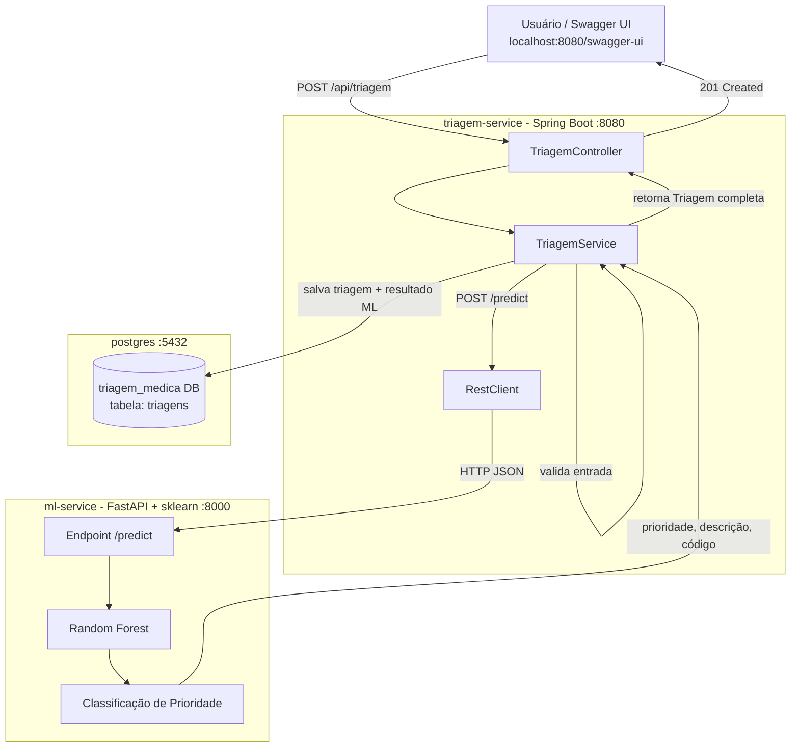

# Triagem Médica Inteligente

Sistema de triagem médica que utiliza **Machine Learning** para classificar a prioridade de atendimento de pacientes com base no **Protocolo de Manchester**, analisando sinais vitais em tempo real.

**Matéria:** Microserviços para Ciência de Dados  
**Grupo 2 — Faculdade Donà Duzzi**

---

## Arquitetura



### Fluxo resumido

1. Usuário envia sinais vitais via Swagger ou `curl`
2. Java valida os dados e repassa ao serviço Python
3. Python classifica com Random Forest (Protocolo de Manchester)
4. Java salva o resultado no PostgreSQL e retorna a prioridade ao usuário

---

## Tecnologias

| Camada | Tecnologia |
|---|---|
| API Backend | Java 21 + Spring Boot 4 |
| Modelo ML | Python 3.11 + FastAPI + scikit-learn |
| Banco de dados | PostgreSQL 16 |
| Orquestração | Docker Compose |
| Documentação | Swagger UI (springdoc-openapi) |

---

## Como rodar

**Pré-requisito:** Docker e Docker Compose instalados.

```bash
# 1. Clone o repositório
git clone https://github.com/Rafaelmlima26/Grupo2_Triagem_Medica_Inteligente.git
cd Grupo2_Triagem_Medica_Inteligente

# 2. Suba todos os serviços
docker-compose up --build

# 3. Aguarde os três serviços ficarem healthy e acesse:
#    Swagger UI  → http://localhost:8080/swagger-ui/index.html
#    ML Service  → http://localhost:8000/health
#    PostgreSQL  → localhost:5432 (banco: triagem_medica, usuário: admin)
```

---

## Endpoints

### `POST /api/triagem` — Realizar triagem

Envia os sinais vitais do paciente e recebe a classificação de prioridade.

**Exemplo de requisição:**
```json
{
  "nomePaciente": "João Silva",
  "idade": 45,
  "temperatura": 39.5,
  "freqCardiaca": 115,
  "pressaoSistolica": 95,
  "saturacaoO2": 91,
  "nivelDor": 8
}
```

**Exemplo de resposta (201 Created):**
```json
{
  "id": 1,
  "nomePaciente": "João Silva",
  "idade": 45,
  "temperatura": 39.5,
  "freqCardiaca": 115.0,
  "pressaoSistolica": 95.0,
  "saturacaoO2": 91.0,
  "nivelDor": 8,
  "prioridade": "Laranja",
  "descricaoPrioridade": "Muito Urgente - Até 10 minutos",
  "codigoPrioridade": 1,
  "dataTriagem": "2026-06-15T14:30:00"
}
```

### `GET /api/triagem` — Histórico completo

Retorna todas as triagens salvas no banco.

### `GET /api/triagem/{id}` — Buscar por ID

### `GET /api/triagem/buscar?nome={nome}` — Buscar por nome do paciente

---

## Níveis de prioridade (Protocolo de Manchester)

| Cor | Descrição | Tempo máximo |
|---|---|---|
| 🔴 Vermelho | Emergência | Imediato |
| 🟠 Laranja | Muito Urgente | 10 minutos |
| 🟡 Amarelo | Urgente | 60 minutos |
| 🟢 Verde | Pouco Urgente | 120 minutos |
| 🔵 Azul | Não Urgente | 240 minutos |

---

## Estrutura do projeto

```
Grupo2_Triagem_Medica_Inteligente/
├── docker-compose.yml          # orquestração dos 3 serviços
│
├── ml-service/                 # serviço Python (FastAPI + sklearn)
│   ├── app.py                  # API FastAPI com endpoint /predict
│   ├── train_model.py          # treina o Random Forest e salva model.joblib
│   ├── requirements.txt
│   └── Dockerfile              # treina o modelo no build
│
└── triagem-medica/             # serviço Java (Spring Boot)
    ├── src/main/java/.../
    │   ├── controller/         # TriagemController (REST + Swagger)
    │   ├── service/            # TriagemService (lógica + chamada ao ML)
    │   ├── repository/         # TriagemRepository (JPA)
    │   ├── model/              # Triagem (entidade JPA)
    │   ├── dto/                # TriagemRequest, MlResponse
    │   └── config/             # RestClientConfig, SwaggerConfig
    ├── src/main/resources/
    │   └── application.yaml
    ├── pom.xml
    └── Dockerfile
```
